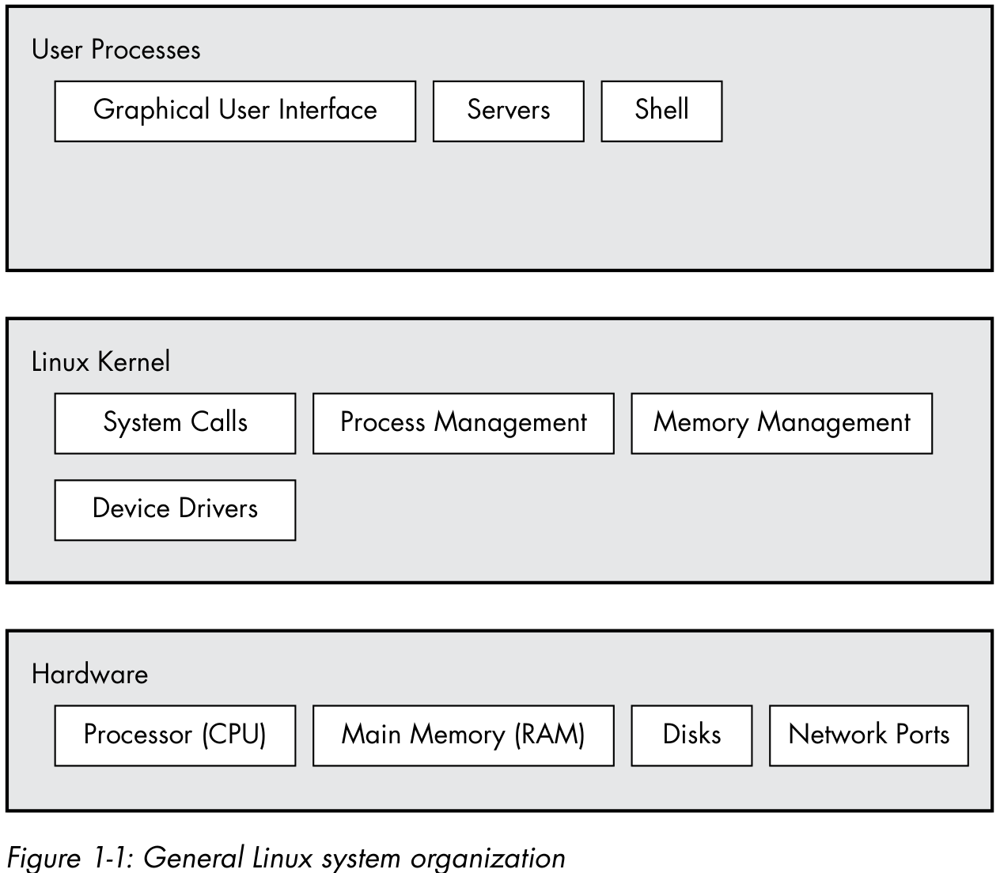

# Big picture

## 内核

内核有以下职能：

- 进程管理
- 内存管理
- 设备管理
- 系统调用

### 进程管理

管理进程的启动、暂停、恢复、调度和终止。

### 内存管理

### 设备管理

### 系统调用

## 用户空间

内核为用户进程分配的主存，称之为`用户空间`。

## 用户

## 其他

### Shell 输入输出

把 `conmmand` 的输出输出到文件 `file`。如果 `file` 不存在则会创建，如果存在就会覆盖。 `-C` 选项可以避免被覆盖。
> $ command > file

追加输出内容到文件使用下面命令：
> $ command >> file

使用管道 `|` 可以将输出作为管道后的命令的输入。
> $ head /proc/cpuinfo | tr a-z A-Z

### Shell 输入输出重定向

标准的输入输出有：
- 0: stdin
- 1: stdout
- 2: stderr

以下命令会在命令窗口显示错误，而 `f` 文件为空：
> $ ls /fffffffff > f

如果需要重定向错误输出，可以使用：
> $ ls /fffffffff > f 2> e

其中 `2>` 指的是将标准错误输出重定向输出到 `e`。也可以将标准错误输出重定向到标准错误输出上：
> ls /fffffffff > f 2>&1

